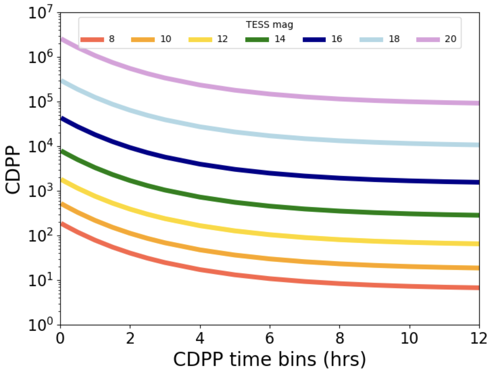

# Overview
The TESS team has provided a summary of the requested target lists and highlighted proposals for which there may be technical concerns related to the observations. **Unless otherwise noted, these issues should not disqualify the proposal; instead, the flags should be used to guide the discussion.**

We note proposals that have a number of brighter or fainter TESS targets. Faint targets have lower precision than bright targets, and so in some cases may not meet science requirements. To better aid panels in understanding the precision limits of TESS and guide the evaluations, we include a note for proposals with bright or faint targets. 

- Brighter targets may saturate, starting at around a TESS magnitude of 8, and excess charge from saturated pixels is conserved and spread across adjacent pixels in a CCD column. 
- Precision photometry can still be achieved by creating a photometric aperture that is large enough to encompass all excess charge. 
- The TESS bright limit is around TESS magnitude 4, where standard aperture photometry becomes unreliable.
- Mission lightcurve pipelines have been optimized for targets in the 8-14 range.  They may be used, but less reliably in the 14-16 magnitude range.  Mission pixel produts (TPFs) may be used at all magnitudes.
- Above 16th magnitude, users tend to prefer creating their own lightcurves from mission pixel products using techniques matched to their science goals (e.g. scene modelling, PRF photometry, difference imaging) due to crowding/contamination.  

Other Notes:

- Targets without a targetlist will not have summaries.  Please evaluate them using the information contained in the proposal and the feasibility information on this page. 
- Some programs request a very large number of targets (e.g. 10000+ 120s or 2000+ 20s). If not sufficiently justified by their proposal, advocated for by the panel, or justified by their proposal size (e.g. small vs large) **targets at the bottom of their list may be less likely to be observed in order to maintain programmatic balance.**
- Every 20s target is also a 120s target.

Below, we include a figure showing the Combined Differential Photometric Precision (CDPP), measured in ppm, for targets as a function time binning. CDPP is an estimate of the precision of TESS data when binned to given time durations. The colored lines show models for different stellar magnitudes. To read this figure, we can see that an 18th magnitude star will have a CDPP of approximately 10,000ppm over 10 hours, i.e. that we expect 18th magnitude stars have 1% precision when binned to 10 hours.

:::: {layout="[0.475, -0.05, 0.475]"}

:::{#firstcol}
{width=50%}
:::

:::{#secondcol}
| **TESS Magnitude** | 1-hr  precision(%) | 10-hr precision(%) | 20-hr precision(%) |
|--------------------|:-------------------|:-------------------|:-------------------|
|8                   | 0.008              | 0.0007             | 0.0006             |
|10                  | 0.022              | 0.002              | 0.002              |
|12                  | 0.076              | 0.007              | 0.006              |
|14                  | 0.33               | 0.031              | 0.026              |
|16                  | 1.81               | 0.17               | 0.14               |
|18                  | 12.4               | 1.15               | 0.98               |
|20                  | 107                | 99                 | 84.                | 
:::

::::